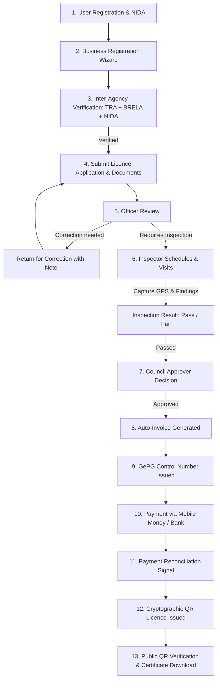

# e-Leseni — Complete Project Flow & Architecture

> **e-Leseni** is a full-stack digital licensing and regulatory compliance platform built for Tanzania Local Government Authorities (LGAs / Halmashauri). It digitises the entire lifecycle of business licensing, from business registration and inter-agency verification (TRA, BRELA, NIDA) to inspection, council approval, GePG electronic revenue collection, and tamper-proof QR code licence issuance.

---

## 1. System Architecture & Tech Stack

```
┌────────────────────────────────────────────────────────────────────────┐
│                        CLIENT / ACCESSIBILITY                          │
│                                                                        │
│   Web Portal (Angular 18)     Mobile / Responsive     USSD (*152*00#)  │
└───────────────────────────────────┬────────────────────────────────────┘
                                    │ HTTP REST + SSE Stream
┌───────────────────────────────────▼────────────────────────────────────┐
│                    API GATEWAY & BACKEND CORE                          │
│                     (Django REST Framework)                            │
│                                                                        │
│   • accounts      — Auth, JWT, Roles, Profile, Admin User CRUD        │
│   • businesses    — Business entity, multi-location, documents         │
│   • lga           — Councils, Wards, Licence Catalog, Activities       │
│   • applications  — State machine, review queue, document validation   │
│   • payments      — Invoices, GePG integration, payment signals        │
│   • licences      — Crypto QR generation, verification, PDF download   │
│   • notifications — SMS notifications at each status milestone        │
│   • realtime      — Server-Sent Events (SSE) live updates              │
│   • ussd          — USSD menu engine for basic phones                  │
└───────────────────────────────────┬────────────────────────────────────┘
                                    │
┌───────────────────────────────────▼────────────────────────────────────┐
│                    eGA GovESB / NATIONAL INTEGRATIONS                  │
│                                                                        │
│      NIDA              TRA (ITAX)           BRELA (ORES)         GePG  │
│  National ID      Taxpayer ID (TIN)     Business Reg.     Government   │
│  Verification         Verification       Verification      Payments    │
└────────────────────────────────────────────────────────────────────────┘
```

- **Frontend**: Angular 18 (standalone components, signals, reactive forms, Tailwind CSS).
- **Backend**: Python 3.12+ / Django 5+ & Django REST Framework.
- **Database**: PostgreSQL with transactional integrity.
- **Authentication**: JWT (`SimpleJWT`) with role claims.
- **Real-Time**: Server-Sent Events (SSE) `/api/events/stream/`.
- **Omnichannel**: Web responsive app + USSD interface (`ussd/`).

---

## 2. Actors & System Roles

| Role | Code | Responsibility |
|------|------|----------------|
| **Applicant** | `APPLICANT` | Citizen business owner: registers businesses, uploads mandatory compliance documents, applies for licences, pays invoices via GePG, prints licences. |
| **Licensing Officer** | `OFFICER` | Council staff: reviews incoming applications, manages council licence catalog and business activity taxonomy, returns applications for correction with notes, schedules inspections. |
| **Field Inspector** | `INSPECTOR` | Field officer: conducts premises inspections, captures GPS device coordinates, submits pass/fail inspection findings. |
| **Licensing Approver** | `APPROVER` | Senior council official (e.g., Trade Officer / Council Director): reviews inspected applications, approves or rejects applications, initiates invoicing. |
| **System Administrator** | `ADMIN` | National / Council oversight: full CRUD management of all system users (Officers, Inspectors, Approvers, Admins), LGA council configurations, cross-council oversight, password resets, and account controls. |

---

## 2.1 Demo & System Login Accounts

The database includes pre-configured accounts for each role across the licensing lifecycle:

### Primary Council Dataset (Ilala Municipal Council)

| System Role | Username | Password | Council / Scope | Key Capabilities & Workspace |
|-------------|----------|----------|-----------------|------------------------------|
| **System Admin** | `admin` | `Demo@1234` | All LGAs (National) | User CRUD (`/staff/users`), cross-council queue, password reset |
| **Licensing Officer** | `officer1` | `Demo@1234` | Ilala Municipal | Review queue (`/staff/review`), return for correction, scheduling |
| **Field Inspector** | `inspector1` | `Demo@1234` | Ilala Municipal | Inspection queue (`/staff/inspections`), GPS capture, findings report |
| **Licensing Approver** | `approver1` | `Demo@1234` | Ilala Municipal | Approval queue (`/staff/approvals`), statutory approval, invoicing |
| **Applicant (Citizen 1)** | `applicant1` | `Demo@1234` | Citizen Owner | "Mama Neema Foods" owner (`/dashboard`, `/businesses`, `/apply`) |
| **Applicant (Citizen 2)** | `applicant2` | `Demo@1234` | Citizen Owner | "Komba Hardware" owner (`/dashboard`, `/businesses`, `/apply`) |

### Secondary Council Dataset (Dar es Salaam City Council)

| System Role | Username | Password | Council / Scope | Key Capabilities |
|-------------|----------|----------|-----------------|------------------|
| **Licensing Officer** | `officer` | `Password1234!` | Dar es Salaam City | Review queue & scheduling |
| **Field Inspector** | `inspector` | `Password1234!` | Dar es Salaam City | Inspection queue & GPS verification |
| **Licensing Approver** | `approver` | `Password1234!` | Dar es Salaam City | Approval queue & licence issuance |
| **Applicant** | `applicant` | `Password1234!` | Citizen Owner | Application filing & GePG payments |

### Mufindi District Council Dataset (Iringa Region)

| System Role | Username | Password | Council / Scope | Key Capabilities & Sample Data |
|-------------|----------|----------|-----------------|--------------------------------|
| **Licensing Officer** | `officer_mufindi` | `Demo@1234` | Mufindi DC (Iringa) | Reviews applications for Mufindi, schedules inspections, returns with notes |
| **Field Inspector** | `inspector_mufindi` | `Demo@1234` | Mufindi DC (Iringa) | Conducts premises inspections across Mufindi wards (Igowole, etc.) with GPS |
| **Licensing Approver** | `approver_mufindi` | `Demo@1234` | Mufindi DC (Iringa) | Statutory approval for Mufindi businesses & advances to GePG invoicing |
| **Applicant (Citizen)** | `applicant_mufindi` | `Demo@1234` | Citizen Owner | "Mufindi Highland Tea & Timber" owner, application in queue for review |

---

## 3. The Complete End-to-End Lifecycle Flow



---

### Step 1: User Registration & Authentication
1. **Public Registration**:
   - The user visits `/register` and provides `username`, `first_name`, `last_name`, `email`, `phone_number`, `password`, and optional 20-digit `nida_number`.
   - Backend endpoint: `POST /api/auth/register/`.
2. **Authentication**:
   - Login via `POST /api/auth/login/` returning JWT access & refresh tokens with user role and profile details.
   - Self-service password recovery available via `POST /api/auth/password-reset/` and `POST /api/auth/password-reset/confirm/`.
3. **Profile Management**:
   - Citizens can update their contact details, add or edit NIDA numbers via `PATCH /api/auth/me/update/`, and change passwords via `POST /api/auth/me/change-password/`.

---

### Step 2: Business Registration & Identity Setup
To eliminate unlicensed shell businesses, council licensing requires a verified business identity:
1. **5-Step Registration Wizard** (`/businesses`):
   - **Step 1: Business Details**: Business name, activity taxonomy, sector.
   - **Step 2: BRELA Registration**: Verification or registration via BRELA (Business Registrations and Licensing Agency). Produces official BRELA registration number.
   - **Step 3: TRA TIN Integration**: Taxpayer Identification Number application linked to the owner's NIDA number.
   - **Step 4: Street Identification Letter**: Upload of official street/mtaa chairperson's identification letter confirming operating premises.
   - **Step 5: Business Location**: Region, council (LGA), ward, street, and plot number.
2. **Verification Gate**:
   - `POST /api/businesses/{id}/verify/` automatically runs verification against TRA, BRELA, and NIDA.
   - A business only receives the **VERIFIED** badge when all four pillars pass:
     - ✅ Valid NIDA on applicant profile
     - ✅ Valid TRA TIN
     - ✅ Valid BRELA registration number
     - ✅ Street identification letter on file

---

### Step 3: Licence Application
1. **Wizard Initiation** (`/apply`):
   - Applicant selects their verified business and registered premises.
   - Applicant selects target LGA council and licence type (e.g., Food & Beverage, Retail, Industrial, Hotel).
2. **Requirements & Document Uploads**:
   - Dynamic document requirements loaded from `lga.Requirement` (e.g., Lease Agreement, Health Clearance, Fire Certificate, OSHA permit).
   - Mandatory document validation: Applicant cannot submit unless all mandatory documents are uploaded as valid PDFs (`POST /api/applications/{id}/documents/`).
3. **Submission**:
   - Application transitions from `DRAFT` to `SUBMITTED`.
   - Reference number auto-generated (e.g., `EL-ILALA-2026-00012`).
   - Instant SMS dispatch to applicant phone confirming receipt.

---

### Step 4: Staff Review & State Machine Workflow
Applications move through an audited role-scoped state machine:

#### 4.1 Officer Review (`OFFICER`)
- Officer accesses their LGA review queue (`/staff/review`).
- Starts review: `SUBMITTED` → `UNDER_REVIEW` (auto-assigns officer).
- **Return for Correction**: If any document is outdated or information is missing, the officer inputs a note (e.g., *"Please attach a valid 2026 OSHA safety permit"*).
  - Application transitions to `RETURNED_FOR_CORRECTION`.
  - Applicant is notified by SMS and sees the exact correction instructions on their dashboard.
  - Applicant uploads missing documents and resubmits (`DRAFT` → `SUBMITTED`).
- **Schedule Inspection**: Officer specifies inspection date/time:
  - Application moves to `INSPECTION_SCHEDULED`.

#### 4.2 Field Inspection (`INSPECTOR`)
- Field inspector views scheduled premises in their LGA (`/staff/inspections`).
- **Location Verification**: Inspector uses device GPS capture to verify the physical premises match the application.
- **Record Findings**:
  - Inspector records inspection findings and selects **Passed** or **Failed**.
  - Passed: transitions application to `INSPECTED`.
  - Failed: transitions application to `REJECTED` with specific findings.

#### 4.3 Council Approval (`APPROVER`)
- Trade Officer / Approver accesses `/staff/approvals`.
- Reviews full dossier: applicant identity, verified TRA/BRELA records, attached compliance documents, and inspector findings with GPS coordinates.
- Approver clicks **Approve**:
  - Application transitions to `APPROVED`.
  - SMS alert sent to citizen confirming approval.

---

### Step 5: Invoicing & GePG Electronic Payments
1. **Invoice Auto-Generation**:
   - Transitioning to `PAYMENT_PENDING` automatically creates an `Invoice` based on the council's approved fee schedule.
2. **GePG Control Number Issuance**:
   - System calls Government Electronic Payment Gateway (GePG) provider to issue a 10-digit control number (e.g., `9912345678`).
   - Control number and payment instructions are immediately sent to the applicant's mobile phone via SMS.
3. **Payment Settlement**:
   - Citizen pays via mobile money (M-Pesa, Airtel Money, Tigo Pesa, Halopesa) or bank agent.
   - When payment completes, `payments.Payment` record is created.
   - Django signal `post_save` on `Payment` automatically settles the invoice and triggers licence issuance.

---

### Step 6: Licence Issuance & QR Verification
1. **Automated Issuance**:
   - Status advances: `PAYMENT_PENDING` → `PAID` → `ISSUED`.
   - Licence record generated with unique licence number (e.g., `LIC-ILALA-2026-00045`), validity period (12 months), and SHA-256 HMAC cryptographic verification token.
2. **Public QR Code Verification (`/verify`)**:
   - Any law enforcement officer, council inspector, or customer can scan the QR code on the certificate or manually enter the licence number / token at `/verify`.
   - Returns real-time cryptographic verification:
     - Business Name & Registration details
     - Council name & Licence category
     - Validity dates (Active, Expired, Revoked)
     - Security signature verification
3. **Certificate Printing**:
   - Business owner downloads or prints clean official certificate directly from their `/dashboard`.

---

### Step 7: System Users & Staff Management (Admin CRUD)
Full administrative control over all actors in the ecosystem:
1. **Admin Workspace** (`/staff/users`):
   - Real-time search and filter by role, assigned LGA council, and active status.
2. **CRUD Capabilities**:
   - **Add New Staff**: Register Licensing Officers, Inspectors, Approvers, and Admins with initial passwords, contact information, and LGA council assignments.
   - **Edit User Profile**: Modify roles, reassign to different LGAs, and update contact information.
   - **Reset Password**: Direct administrative password reset.
   - **Account Activation**: Instantly toggle accounts active/inactive.
   - **Safe Deletion**: Deletes unused accounts, or gracefully deactivates accounts with foreign-key audit trails (inspections, reviews, applications) to preserve statutory compliance records.

---

## 4. Omnichannel: USSD Interface (`*152*00#`)
For non-smartphone users and informal traders in local markets:
1. Citizen dials USSD shortcode.
2. Interactive text menu allows:
   - Registration with Phone & NIDA.
   - Checking status of existing licence applications.
   - Requesting GePG payment control numbers.
   - Confirming payment receipts.
3. State session management tracks user steps across network telcos.

---

## 5. Security & Compliance Architecture

- **Role-Based Access Control (RBAC)**: All mutations check both user roles and LGA council boundaries.
- **Tamper-Resistant State Machine**: Invalid status transitions are rejected at the model and API layers.
- **Audit Logging**: Every transition logs `from_status`, `to_status`, timestamp, acting officer, and optional notes in `StatusHistory`.
- **Statutory Document Storage**: All official attachments are validated and stored with strict extension checking.
- **Live Notifications**: Citizen transparency via instant SMS and WebSockets/SSE updates.
